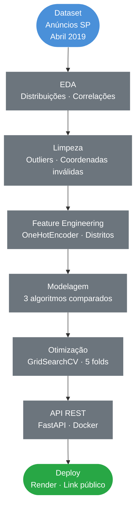
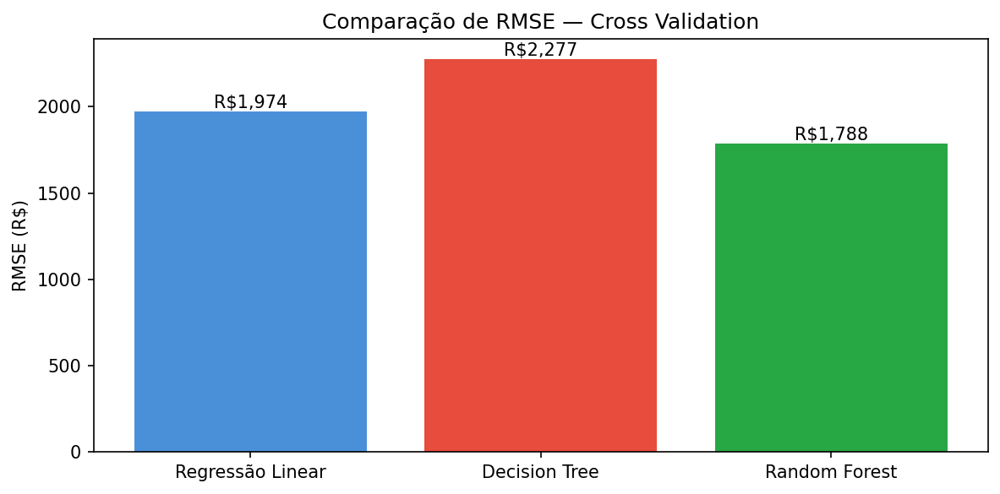
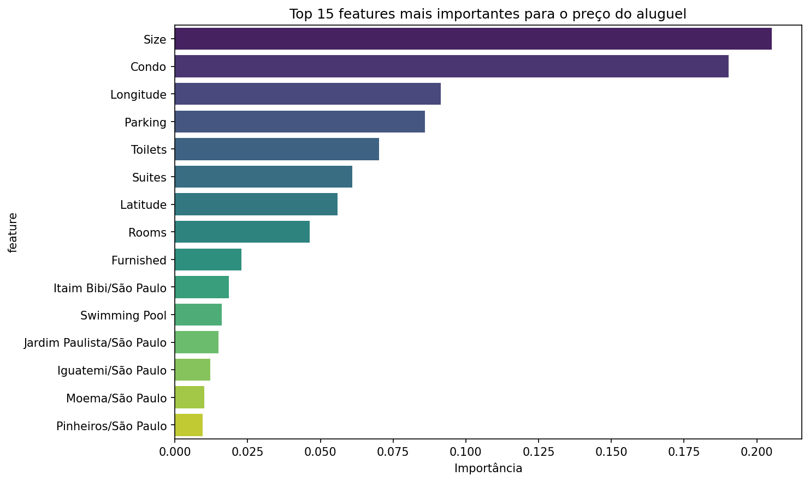
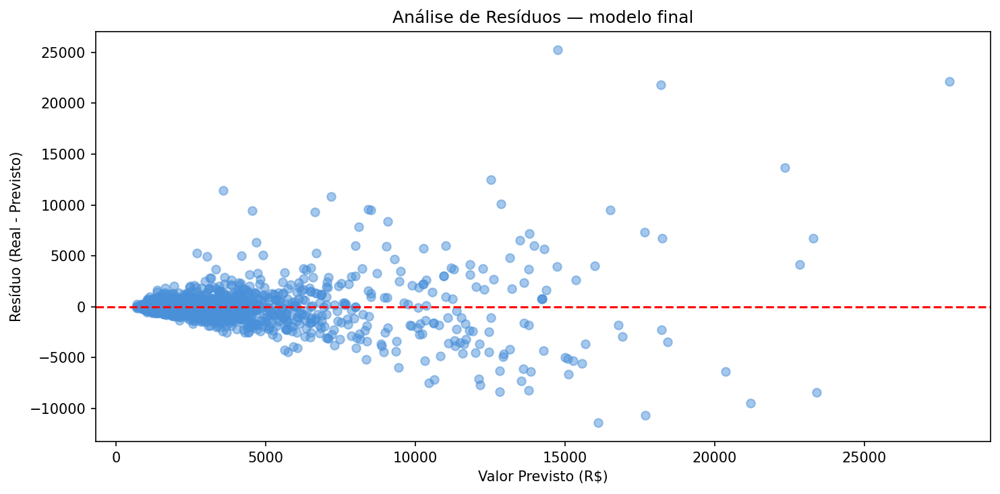
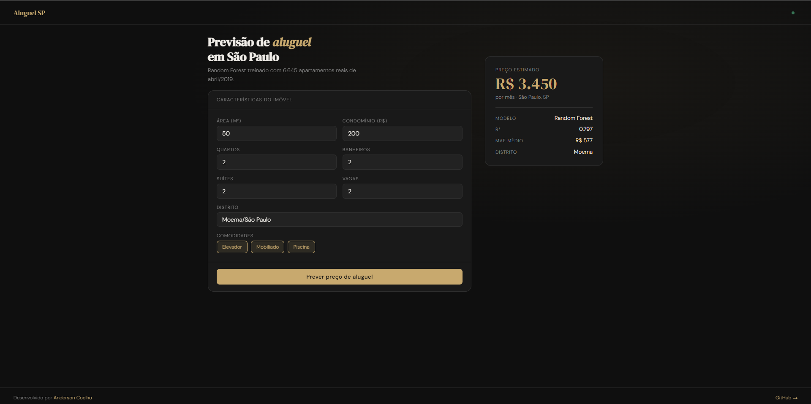
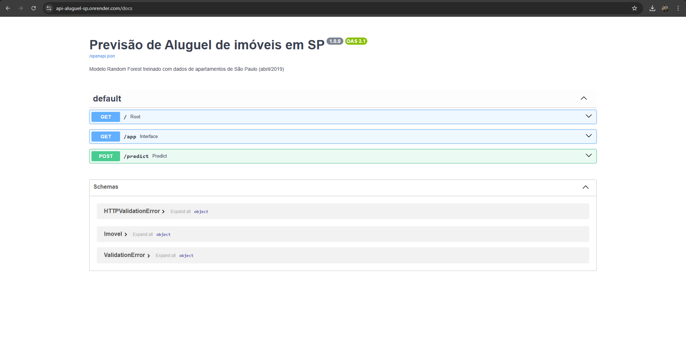

# Prevendo Preços de Aluguel de Apartamentos com Machine Learning

### EDA · Regressão · GridSearchCV · Random Forest · FastAPI · Docker · Deploy

&nbsp;

[](https://www.python.org/)
[](https://scikit-learn.org/)
[](https://fastapi.tiangolo.com/)
[](https://www.docker.com/)
[](https://api-aluguel-sp.onrender.com)

&nbsp;
> Pipeline completo de ML para previsão do preço de aluguel de apartamentos
> em São Paulo da EDA ao deploy em produção com API REST e interface interativa.

&nbsp;

**[Acessar interface interativa](https://api-aluguel-sp.onrender.com/app)** &nbsp;|&nbsp; **[Documentação da API](https://api-aluguel-sp.onrender.com/docs)**

---

## Índice

- [Contexto](#contexto)
- [Objetivos](#objetivos)
- [Pipeline do Projeto](#pipeline-do-projeto)
- [Tecnologias](#tecnologias-utilizadas)
- [Dataset](#dataset)
- [Etapas Detalhadas](#etapas-detalhadas)
- [Modelos Avaliados](#modelos-avaliados)
- [Principais Resultados](#principais-resultados)
- [API em Produção](#api-em-produção)
- [Estrutura do Repositório](#estrutura-do-repositório)
- [Autor](#autor)

---

## Contexto

Projeto de Machine Learning aplicado ao mercado imobiliário de São Paulo, utilizando dados reais de anúncios de apartamentos para aluguel. O modelo preditivo foi desenvolvido, otimizado e colocado em produção como uma API REST containerizada com Docker e hospedada no Render.

| Etapa | Descrição |
|---|---|
| **EDA** | Análise exploratória, distribuições e correlações |
| **Limpeza** | Remoção de outliers e coordenadas inválidas |
| **Feature Engineering** | Encoding de variáveis categóricas (distritos) |
| **Modelagem** | Comparação entre 3 algoritmos de regressão |
| **Otimização** | GridSearchCV para tuning do modelo final |
| **Deploy** | API REST com FastAPI + Docker + Render |

---

## Objetivos

- Desenvolver um modelo de regressão supervisionada para prever o valor de aluguel
- Comparar o desempenho de Regressão Linear, Decision Tree e Random Forest
- Otimizar hiperparâmetros do melhor modelo via GridSearchCV
- Avaliar o modelo final com métricas completas (RMSE, MAE, R²) e análise de resíduos
- Criar uma API REST com FastAPI e containerizar com Docker
- Fazer deploy em produção com link público acessível

---

## Pipeline do Projeto



---

## Tecnologias Utilizadas

| Tecnologia | Uso no Projeto |
|---|---|
|  | Linguagem principal |
|  | Manipulação e limpeza dos dados |
|  | Modelos, Cross Validation e GridSearchCV |
|  | Visualizações e gráficos de avaliação |
|  | Visualizações estatísticas |
|  | Mapa interativo de preços por localização |
|  | API REST para servir o modelo em produção |
|  | Containerização da aplicação |
|  | Hospedagem do deploy em produção |

---

## Dataset

**Fonte:** [Imóveis em São Paulo Venda / Aluguel Abril 2019](https://www.kaggle.com/datasets/argonalyst/sao-paulo-real-estate-sale-rent-april-2019) Kaggle

| Característica | Detalhe |
|---|---|
| Volume total | ~13.000 anúncios |
| Volume para aluguel (após limpeza) | **6.645 apartamentos** |
| Outliers removidos | 583 registros (coordenadas inválidas + preços extremos) |
| Período | Abril de 2019 |

**Estatísticas descritivas Preço de Aluguel (após limpeza):**

| Métrica | Valor |
|---|---|
| Média | R$ 2.808 |
| Mediana | R$ 2.000 |
| Máximo considerado | R$ 15.000 |
| Área média | 89,5 m² |

---

## Etapas Detalhadas

**Análise Exploratória de Dados (EDA)**
- Visualização da distribuição geográfica dos preços via mapa interativo Plotly
- Identificação de 483 imóveis com coordenadas inválidas (lat/lon = 0)
- Análise de correlação entre todas as variáveis numéricas e `Price`

**Top correlações com o preço de aluguel:**

| Feature | Correlação com Price |
|---|---|
| Size (área m²) | **0.732** |
| Condo (condomínio) | 0.700 |
| Parking (vagas) | 0.641 |
| Suites | 0.588 |
| Toilets (banheiros) | 0.583 |

**Preparação dos Dados**
- Remoção de imóveis com coordenadas geográficas inválidas
- Remoção de outliers de preço acima de R$ 15.000 (1,4% do dataset)
- Encoding de `District` via `get_dummies`
- Split treino/teste: **80% / 20%** com `random_state=42`

---

## Modelos Avaliados

### Comparação de RMSE Cross Validation



| Modelo | RMSE | MAE | R² |
|---|---|---|---|
| Regressão Linear | R$ 1.171 | R$ 736 | 0.751 |
| Decision Tree | R$ 1.354 | R$ 719 | 0.667 |
| **Random Forest** | **R$ 1.027** | **R$ 552** | **0.808** |

### Features Mais Importantes



> Tamanho (m²) e condomínio são os fatores mais determinantes no preço do aluguel, seguidos pelo número de suítes e a localização geográfica.

---

## Principais Resultados

### Otimização com GridSearchCV

| Parâmetro | Valores Testados |
|---|---|
| `n_estimators` | 100, 200, 300 |
| `max_depth` | None, 10, 20 |
| `min_samples_split` | 2, 5, 10 |
| `max_features` | sqrt, log2 |

### Performance do Modelo Final

| Métrica | Valor |
|---|---|
| **R²** | **0.797** |
| **MAE** | **R$ 577** |
| **RMSE** | **R$ 1.056** |
| Resíduo médio | R$ 24 (sem viés sistemático) |

> O modelo explica **79,7% da variação nos preços** com erro médio de R$ 577 por previsão.

### Análise de Resíduos



> Resíduos distribuídos simetricamente em torno de zero sem viés sistemático. A maior dispersão em imóveis de alto valor é esperada dado o comportamento heterogêneo do segmento de luxo.

---

## API em Produção

### Interface Interativa

[](https://api-aluguel-sp.onrender.com/app)

> Acesse a interface em: **[api-aluguel-sp.onrender.com/app](https://api-aluguel-sp.onrender.com/app)**

### Documentação Swagger

[](https://api-aluguel-sp.onrender.com/docs)

> Documentação completa da API em: **[api-aluguel-sp.onrender.com/docs](https://api-aluguel-sp.onrender.com/docs)**

### Exemplo de Requisição

```bash
curl -X POST https://api-aluguel-sp.onrender.com/predict \
  -H "Content-Type: application/json" \
  -d '{
    "Condo": 500,
    "Size": 65,
    "Rooms": 2,
    "Toilets": 2,
    "Suites": 1,
    "Parking": 1,
    "Elevator": 1,
    "Furnished": 0,
    "Swimming_Pool": 0,
    "Latitude": -23.605,
    "Longitude": -46.665,
    "District": "Moema/São Paulo"
  }'
```

### Resposta

```json
{
  "preco_previsto": 3450.0,
  "unidade": "BRL",
  "modelo": "RandomForestRegressor"
}
```

### Endpoints disponíveis

| Método | Endpoint | Descrição |
|---|---|---|
| `GET` | `/` | Status da API |
| `GET` | `/app` | Interface interativa |
| `GET` | `/docs` | Documentação Swagger |
| `POST` | `/predict` | Previsão de preço |

---

## Estrutura do Repositório

```
prevendo_precos_de_aluguel_com_machine_learning/
│
├──  assets/                                  # Gráficos e imagens
│   ├── comparacao_modelos.png
│   ├── feature_importance_aluguel.png
│   ├── residuos.png
│   ├── modelo_em_funcionamento.png
│   └── Swagger_UI.png
│
├──  base_de_dados/
│   └── sao-paulo-properties-april-2019.csv     # Dataset original do Kaggle
│
├──  prevendo_preco_de_alugueis_com_ML.ipynb  # Notebook completo
├──  main.py                                  # API FastAPI
├──  index.html                               # Interface interativa
├──  Dockerfile                               # Containerização
├──  modelo_aluguel_sp.pkl                    # Modelo Random Forest treinado
├──  colunas_modelo.pkl                       # Features esperadas pela API
├──  requirements.txt                         # Dependências do projeto
└──  README.md                                # Documentação do projeto
```

---

## Autor

<div align="center">


**Anderson Coelho**
*Cientista de Dados*

[](https://www.linkedin.com/in/anderson-coelho-42671634a/)
[](https://github.com/Anderson1999DC)

</div>

---

<div align="center">
