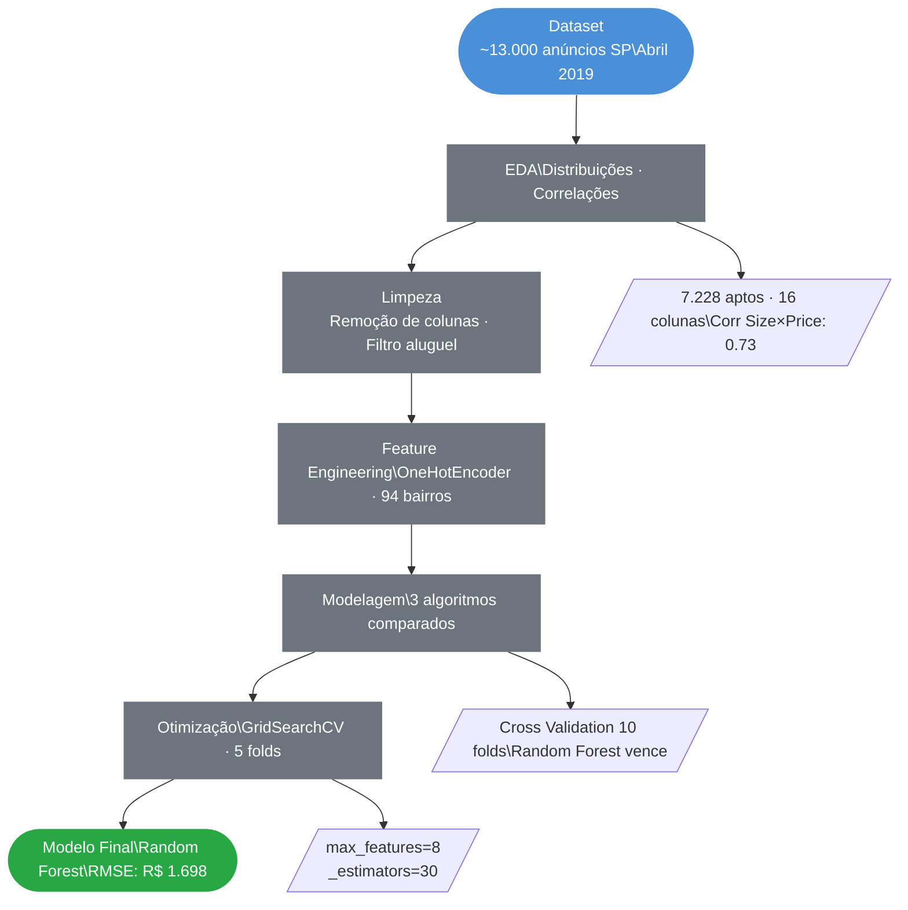
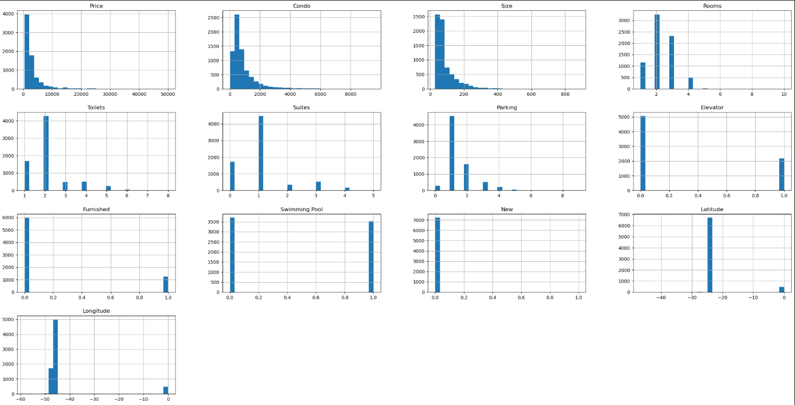
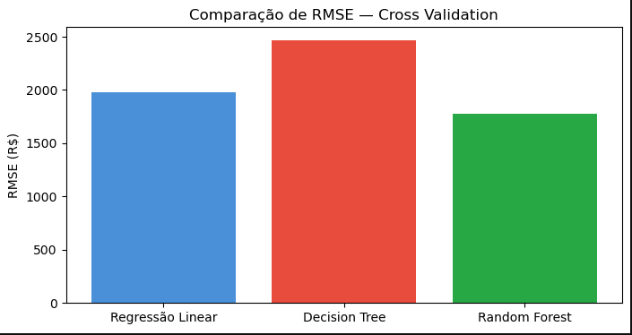
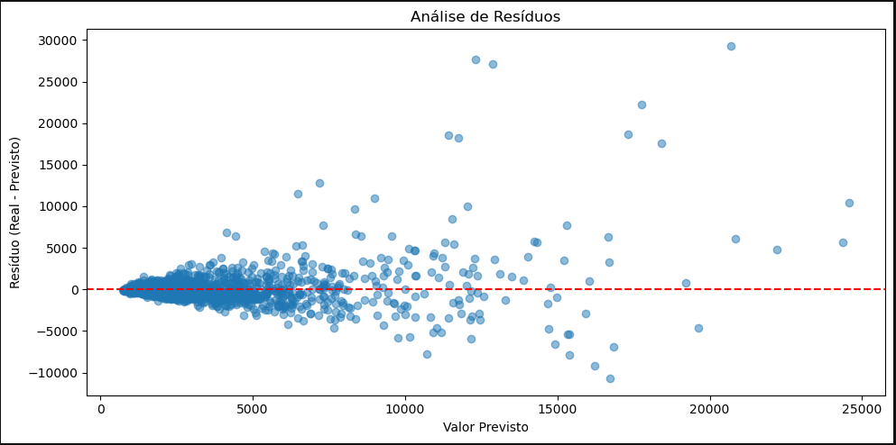

<div align="center">

# Prevendo Preços de Aluguel de Apartamentos com Machine Learning
### EDA · Regressão · Cross Validation · GridSearchCV · Random Forest

<br>

[](https://www.python.org/)
[](https://pandas.pydata.org/)
[](https://scikit-learn.org/)
[](https://plotly.com/)
[]()

<br>

> Pipeline completo de Machine Learning para previsão do preço de aluguel de apartamentos
> em São Paulo, desde a EDA até a otimização do modelo final com GridSearchCV.

</div>

---

## Índice

- [Contexto](#contexto)
- [Objetivos](#objetivos)
- [Pipeline do Projeto](#pipeline-do-projeto)
- [Tecnologias](#tecnologias-utilizadas)
- [Dataset](#dataset)
- [Etapas Detalhadas](#etapas-detalhadas)
- [Modelos Avaliados](#modelos-avaliados)
- [Principais Resultados](#principais-resultados)
- [Estrutura do Repositório](#estrutura-do-repositório)
- [Autor](#autor)

---

## Contexto

Projeto de Machine Learning aplicado ao mercado imobiliário de São Paulo, utilizando dados reais de anúncios de apartamentos para aluguel. O objetivo é construir um modelo preditivo capaz de estimar o valor de aluguel com base nas características do imóvel.

| Etapa | Descrição |
|---|---|
| **EDA** | Análise exploratória, distribuições e correlações |
| **Feature Engineering** | Encoding de variáveis categóricas (94 bairros) |
| **Modelagem** | Comparação entre 3 algoritmos de regressão |
| **Otimização** | GridSearchCV para tuning do modelo final |

---

## Objetivos

- Desenvolver um modelo de regressão supervisionada para prever o valor de aluguel
- Comparar o desempenho de Regressão Linear, Decision Tree e Random Forest
- Validar os modelos com Cross Validation (10 folds) para evitar overfitting
- Otimizar hiperparâmetros do melhor modelo via GridSearchCV
- Avaliar o modelo final com análise de resíduos em dados de teste

---

## Pipeline do Projeto



---

## Tecnologias Utilizadas

| Tecnologia | Uso no Projeto |
|---|---|
|  | Linguagem principal |
|  | Manipulação e limpeza dos dados |
|  | Operações numéricas e cálculo de RMSE |
|  | Modelos, Cross Validation e GridSearchCV |
|  | Histogramas e gráfico de resíduos |
|  | Visualizações estatísticas |
|  | Mapa interativo de preços por localização |

---

## Dataset

**Fonte:** [Imóveis em São Paulo – Venda / Aluguel – Abril 2019](https://www.kaggle.com/datasets/argonalyst/sao-paulo-real-estate-sale-rent-april-2019) — Kaggle
**Uso:** Exclusivamente educacional

| Característica | Detalhe |
|---|---|
| Volume total | ~13.000 anúncios |
| Volume para aluguel | **7.228 apartamentos** |
| Colunas originais | 16 |
| Bairros cobertos | **94 bairros de São Paulo** |
| Período | Abril de 2019 |

**Estatísticas descritivas — Preço de Aluguel:**

| Métrica | Valor |
|---|---|
| Média | R$ 3.078 |
| Mediana | R$ 2.000 |
| Desvio Padrão | R$ 3.523 |
| Mínimo | R$ 480 |
| Máximo | R$ 50.000 |
| Área média | 89,5 m² |

---

## Etapas Detalhadas

**Análise Exploratória de Dados (EDA)**

- Visualização da distribuição geográfica dos preços via mapa interativo Plotly
- Análise de correlação entre todas as variáveis numéricas e `Price`
- Histogramas de distribuição para todas as 12 variáveis numéricas

**Top correlações com o preço de aluguel:**

| Feature | Correlação com Price |
|---|---|
| Size (área m²) | **0.732** |
| Condo (condomínio) | 0.700 |
| Parking (vagas) | 0.641 |
| Suites | 0.588 |
| Toilets (banheiros) | 0.583 |
| Rooms (quartos) | 0.391 |
| Swimming Pool | 0.207 |
| Furnished | 0.172 |

**Preparação dos Dados**

- Filtragem para imóveis do tipo `rent` (aluguel)
- Remoção de colunas irrelevantes para o modelo: `New`, `Property Type`, `Negotiation Type`
- Encoding de `District` via `OneHotEncoder` → 94 novas colunas binárias
- Split treino/teste: **70% / 30%**

---

## Modelos Avaliados

### Distribuição das Variáveis do Dataset



> Distribuições assimétricas em `Price`, `Size` e `Condo` indicam presença de outliers no segmento de alto padrão — comportamento esperado no mercado imobiliário.

---

### Comparação de RMSE — Cross Validation (10 folds)



| Modelo | RMSE Médio (CV) | Desvio Padrão |
|---|---|---|
| Regressão Linear | R$ 1.979 | ± R$ 314 |
| Decision Tree | R$ 2.467 | ± R$ 394 |
| **Random Forest** | **R$ 1.776** | **± R$ 269** |

> O **Random Forest** apresentou o menor RMSE médio e o menor desvio padrão, indicando tanto melhor precisão quanto maior estabilidade entre os folds — o que o torna o mais indicado para otimização.

---

## Principais Resultados

### Otimização com GridSearchCV

Parâmetros testados no Random Forest:

| Parâmetro | Valores Testados |
|---|---|
| `n_estimators` | 3, 10, 30 |
| `max_features` | 2, 4, 6, 8 |
| `bootstrap` | True, False |

**Melhores hiperparâmetros encontrados:**
```
max_features = 8
n_estimators = 30
```

### Performance do Modelo Final

| Métrica | Valor |
|---|---|
| **RMSE — Dados de Teste** | **R$ 1.698** |
| RMSE — Cross Validation (base) | R$ 1.776 |
| RMSE — GridSearch (melhor config) | R$ 1.814 |

> O modelo generaliza bem: o RMSE em dados de teste (**R$ 1.698**) ficou abaixo do RMSE médio de Cross Validation, confirmando ausência de overfitting.

### Análise de Resíduos



> Resíduos distribuídos de forma aproximadamente simétrica em torno de zero, sem viés sistemático. A maior dispersão em imóveis de alto valor é esperada — imóveis de luxo têm precificação mais heterogênea e menos previsível.

### Aplicações do Modelo

- Apoio à precificação em imobiliárias
- Auxílio a proprietários na definição do valor de aluguel
- Geração de inteligência de mercado imobiliário
- Automação de avaliações antes realizadas manualmente

### Próximos Passos Sugeridos

- Testar modelos de boosting (XGBoost, LightGBM) para comparação
- Incluir dados de infraestrutura urbana (metrô, parques, hospitais) como features
- Criar API REST com Flask ou FastAPI para servir o modelo
- Deploy do modelo com interface Streamlit para uso em tempo real

---

## Estrutura do Repositório

```
Prevendo_Precos_de_Aluguel_de_Apartamentos_com_Machine_Learning/
│
├── 📁 assets/                              # Gráficos gerados na análise
│   ├── histogramas_variaveis.png
│   ├── comparacao_dos_3_modelos.png
│   └── residuos_modelo_final.png
│
├── 📁 base_de_dados/
│   └── sao-paulo-properties-april-2019.csv # Dataset original do Kaggle
│
├── 📓 prevendo_preco_de_alugueis_com_ML.ipynb  # Notebook completo
├── 📄 requirements.txt                         # Dependências do projeto
└── 📄 README.md                                # Documentação do projeto
```

---

## Autor

<div align="center">


**Anderson Coelho**
*Cientista de Dados*

[](https://www.linkedin.com/in/anderson-coelho-42671634a/)
[](https://github.com/Anderson1999DC)

</div>

---

<div align="center">

</div>
